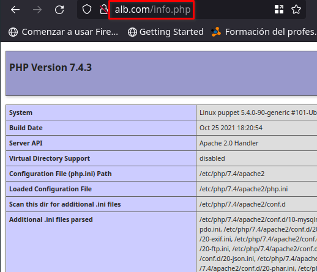
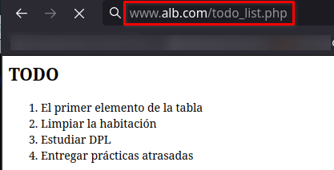

# DPL. UT3-1. Servidor LAMP en Ubuntu
## Servidor LAMP
Una pila “LAMP” es un conjunto de aplicaciones de software de código abierto que se suelen instalar juntas para que un servidor pueda alojar aplicaciones y sitios web dinámicos escritos en **PHP**. Este término es en realidad un acrónimo que representa al sistema operativo **L**inux, con el servidor web **A**pache. Los datos del sitio se almacenan en una base de datos **M**ySQL y el contenido dinámico se procesa mediante **P**HP.
## Práctica
### 1. Prerrequisitos
Partimos de máquina virtual de Ubuntu Server con:
* IP estática 10.11.200.x/16
* Cortafuegos habilitado con puertos necesarios (22, 80) abiertos 
* Conectamos por ssh para realizar los pasos de la configuración.
* Apache2 instalado
* Host Virtual creado:
    * Nombre principal: `www.alb.com`
    * Nombre alternativo: `alb.com`
    * Correo del administrador: `admin@alb.com`
    * Carpeta de inicio: `/var/www/www.alb.com/html`
    * Páginas predeterminadas y orden de carga: `index.php index.html`
    * Página `index.html` en carpeta raíz con contenido `<h1>bienvenido a www.alb.com</h1>`
    * ErrorLog ${APACHE_LOG_DIR}/error.log
    * CustomLog ${APACHE_LOG_DIR}/access.log combined
    * Comprueba funcionamiento
### 2. Instalación de mysql
Mysql es un gestor de base de datos que utilizaremos para almacenar y gestionar los datos de nuestro sitio web. Para instalarlo ejecutamos:

```bash
$ sudo apt install mysql-server
```
Después de instalarlo se recomienda ejecutar un script para eliminar ajustes predeterminados y personalizar la confiugración. Ejecutamos:

```bash
$ sudo mysql_secure_installation
```
Primero nos pregunta si queremos configurar **VALIDATE PASSWORD PLUGIN**.

> **Nota**: La habilitación de esta característica hara que  MySQL rechace con un mensaje de error las contraseñas que no coincidan con los criterios especificados.

Elija **Y** para indicar que sí

A continuación se nos pedirá que seleccionemos un nivel de validación de contraseña. 
> **Nota**: si seleccionamos 2 para indicar el nivel más seguro, recibirá mensajes de error al intentar establecer cualquier contraseña que no contenga números, letras en mayúscula y minúscula, y caracteres especiales, o que se base en palabras comunes del diccionario.

```
There are three levels of password validation policy:

LOW    Length >= 8
MEDIUM Length >= 8, numeric, mixed case, and special characters
STRONG Length >= 8, numeric, mixed case, special characters and dictionary              file

Please enter 0 = LOW, 1 = MEDIUM and 2 = STRONG: 1
```
Como estamos en un entorno de prueba seleccionamos la opción **0**

A continuación se nos pide, que seleccionemos y confirme una contraseña para el root user de MySQL. 

>**Nota**:No debe confundirse con el root del sistema. El usuario **root** de la base de datos es un usuario administrativo con privilegios completos sobre el sistema de base de datos. 

Cómo seleccionamos nivel **LOW** para las contraseñas, debemos poner una de longitud >= a 8 caracteres. Por ejemplo **daw12345**

Se nos muestra un mensaje del tipo:

```
Estimated strength of the password: 100
Do you wish to continue with the password provided?(Press y|Y for Yes, any other key for No) : y
```

Para el resto de las preguntas, presione **y** y ENTER en cada mensaje. Con esto, se eliminarán algunos usuarios anónimos y la base de datos de prueba, se deshabilitarán las credenciales de inicio de sesión remoto de root y se cargarán estas nuevas reglas para que MySQL aplique de inmediato los cambios que realizó.

Cuando terminemos, comprobamos si podemos iniciar sesión en la consola de MySQL al escribiendo:

```bash=
$ sudo mysql
```

Esto permitirá establecer conexión con el servidor de MySQL como **root** user de la base de datos administrativa, al haber usado **sudo** cuando se ejecuta este comando. Cambiará el prompt del sistema a:

```bash
mysql>
```

Para salir de la consola de MySQL, escribimos:

```bash
mysql> exit
```
### 3. Instalación de PHP
**PHP** es el componente que procesará el código para mostrar contenido dinámico. Además del paquete php, necesitaremos:
* **php-mysql**: un módulo PHP que permite que este se comunique con bases de datos basadas en MySQL
* **libapache2-mod-php** para habilitar Apache para gestionar archivos PHP. 
Los paquetes PHP básicos se instalarán automáticamente como dependencias.

Para instalar estos paquetes, ejecute lo siguiente:

```bash
$ sudo apt install php libapache2-mod-php php-mysql
```

Una vez que la instalación se complete, podrá ejecutar el siguiente comando para confirmar la versión de PHP instalada:

```bash
$ php -v
PHP 7.4.3 (cli) (built: Oct 25 2021 18:20:54) ( NTS )
Copyright (c) The PHP Group
Zend Engine v3.4.0, Copyright (c) Zend Technologies
    with Zend OPcache v7.4.3, Copyright (c), by Zend Technologies
```

Para comprobar que apache procesa peticiones en **php** creamos el fichero `/var/www/www.alb.com/html/info.php` e insertamos en el mismo

```php
<?php
phpinfo();
```
Podemos comprobar su funcionamiento accediendo en el navegador a:

```
http://www.alb.com/info.php
```
Se debería mostrar algo similar a:



### 4. Probar la conexión con la base de datos desde PHP

#### Creando base de datos

Para comprobar que PHP puede establecer conexión con MySQL y ejecutar consultas a la base de datos, vamos a crear una tabla de prueba con datos ficticios y realizar consultas relacionadas con su contenido en PHP. Para poder hacerlo, debemos **crear** una base de datos de prueba y un nuevo **usuario** de MySQL debidamente configurado para acceder a ella.

Crearemos una base de datos denominada **todo** y un usuario llamado **todo_user**.

Primero, establecemos conexión con la consola de MySQL usando la cuenta root:

```bash
$ sudo mysql
```

Para crear la base de datos nueva, ejecutmos:

```sql
mysql> CREATE DATABASE todo_database;
```

A continuación crearemos un nuevo usuario y le concederemos privilegios completos sobre la base de datos personalizada que acaba de crear.

```sql
mysql> CREATE USER 'todo_user'@'%' IDENTIFIED WITH mysql_native_password BY 'daw12345';
```

Le damos permiso a este usuario a la base de datos `todo_database`:

```sql
mysql> GRANT ALL ON todo_database.* TO 'todo_user'@'%';
```
Ya podemos cerrar la sesión en mysql:

```sql
mysql> exit
```

Podemos verificar si el usuario nuevo tiene los permisos adecuados al volver a iniciar sesión en la consola de MySQL, esta vez, con las credenciales de usuario personalizadas:

```bash
$ mysql -u todo_user -p
```
La opción `-p` indica a **mysql** que le solicite la contraseña de `todo_user`. 

Después de iniciar sesión en la consola de MySQL, confirmamos que tenemos acceso a la base de datos example_database:

```sql
mysql> SHOW DATABASES;
```

El resultado debería ser:

```
Output
+--------------------+
| Database           |
+--------------------+
| example_database   |
| information_schema |
+--------------------+
2 rows in set (0.000 sec)
```

A continuación, crearemos una tabla de prueba denominada `todo_list`: Desde la consola de MySQL, ejecutando:

```sql
mysql> CREATE TABLE todo_database.todo_list (
        item_id INT AUTO_INCREMENT,
        content VARCHAR(255),
        PRIMARY KEY(item_id)
    );
```


Inserte algunas filas de contenido en la tabla de prueba. 

```sql
mysql> INSERT INTO todo_database.todo_list (content) VALUES ("El primer elemento de la tabla");

mysql> INSERT INTO todo_database.todo_list (content) VALUES ("Limpiar la habitación");

mysql> INSERT INTO todo_database.todo_list (content) VALUES ("Estudiar DPL");

mysql> INSERT INTO todo_database.todo_list (content) VALUES ("Entregar prácticas atrasadas");
```

Para confirmar que los datos se guardaron correctamente en su tabla, ejecuta lo siguiente:
```sql
mysql> SELECT * FROM todo_database.todo_list;
```

Deberíamos obtener:

```sql
+---------+--------------------------------+
| item_id | content                        |
+---------+--------------------------------+
|       1 | El primer elemento de la tabla |
|       2 | Limpiar la habitación          |
|       3 | Estudiar DPL                   |
|       4 | Entregar prácticas atrasadas   |
+---------+--------------------------------+
4 rows in set (0.01 sec)
```

Ya podemos cerrar la conexión con el gestor de base de datos:

```sql
mysql> exit
```

#### Escribiendo script en PHP que accede a la base de datos

Ahora, podrá crear unscript en PHP que se conecte a MySQL y realice consultas relacionadas con su contenido. 

Creamos un nuevo archivo PHP en la carpeta raíz del host virtual:

```bash
$ sudo nano /var/www/www.alb.com/html/todo_list.php
```
Insertamos el siguiente código que establece conexión con la base de datos de MySQL, realiza consultas relacionadas con el contenido de la tabla **todo_list** y muestra los resultados en una **lista**. Si hay un problema con la conexión de la base de datos, generará una **excepción**. :

```php
<?php
$user = "todo_user";
$password = "daw12345";
$database = "todo_database";
$table = "todo_list";

try {
  $db = new PDO("mysql:host=localhost;dbname=$database", $user, $password);
  echo "<h2>TODO</h2><ol>";
  foreach($db->query("SELECT content FROM $table") as $row) {
    echo "<li>" . $row['content'] . "</li>";
  }
  echo "</ol>";
} catch (PDOException $e) {
    print "Error!: " . $e->getMessage() . "<br/>";
    die();
}
```
Guarde y cierramos el archivo.

Ahora, podemos acceder a esta página en el navegador poniendo la URL:

```
http://www.alb.com/todo_list.php
```
El resultado debería ser algo como:




## Recursos
* [How To Install Linux, Apache, MySQL, PHP (LAMP) stack on Ubuntu 20.04 - DigitalOcean](https://www.digitalocean.com/community/tutorials/how-to-install-linux-apache-mysql-php-lamp-stack-on-ubuntu-20-04)
###### tags: `dpl` `ut2` `lamp` `php` `mysql`